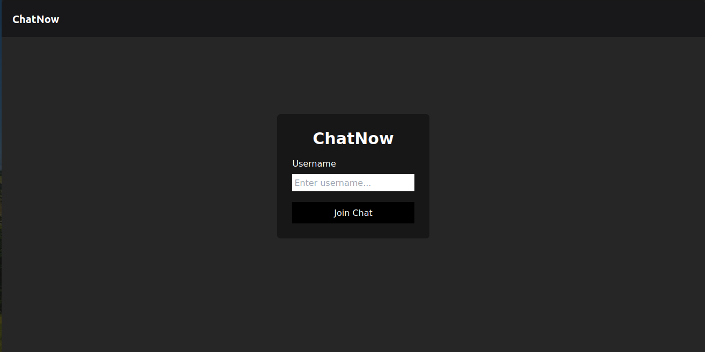
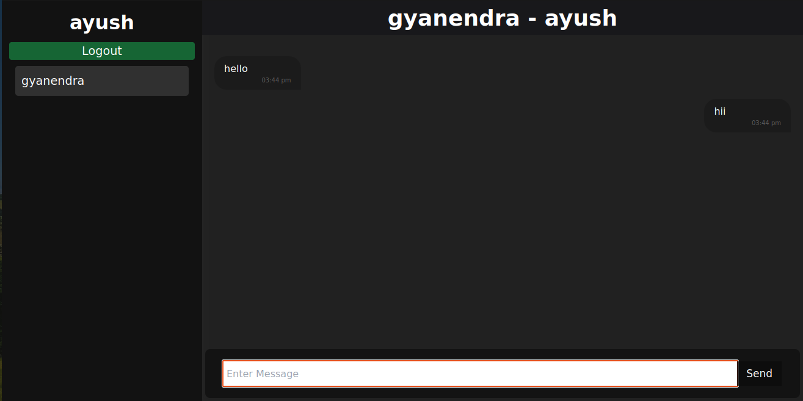

# ChatNow - Real-time Chat Application

ChatNow is a real-time chat application built using React.js and Express. It allows users to engage in live conversations with each other, providing a seamless and responsive chatting experience.

## Features

- Real-time messaging
- User authentication
- Responsive design
- Easy to use interface
- Customizable user profiles

## Technologies Used

- React.js
- Express.js
- Socket.io
- CSS (for styling)
<!-- - MongoDB (for user authentication and data storage) -->

## Screenshots





## Getting Started

### Prerequisites

Make sure you have Node.js and npm installed on your machine.

### Installation

1. Clone the repository:

   ```bash
   git clone https://github.com/gyanendra-baghel/ChatNow.git
   cd ChatNow
   ```

2. Install dependencies for both the client and server:

   ```bash
   # Install server dependencies
   cd server
   npm install

   # Install client dependencies
   cd ../client
   npm install
   ```

<!-- 3. Configure environment variables:

   - Create a `.env` file in the `server` directory and set the following variables:

     ```env
     PORT=3001
     MONGODB_URI=your-mongodb-uri
     ``` -->

3. Start the server and client:

   ```bash
   # Start the server
   cd ../server
   npm start

   # Start the client
   cd ../client
   npm start
   ```

The application should now be running on `http://localhost:5173`.

## Usage

1. Visit `http://localhost:5173` in your web browser.
2. Sign up or log in to start using ChatNow.
3. Create or join chat rooms and start chatting with other users in real-time.

**Note**: The backend socket is running at `http://localhost:8000`.

## Contributing

Contributions are welcome! Feel free to open issues or submit pull requests to improve the project.

## License

This project is licensed under the MIT License - see the [LICENSE](LICENSE) file for details.

## Acknowledgments

- [Socket.io Documentation](https://socket.io/docs/)
- [React Documentation](https://reactjs.org/docs/getting-started.html)
- [Express.js Documentation](https://expressjs.com/)